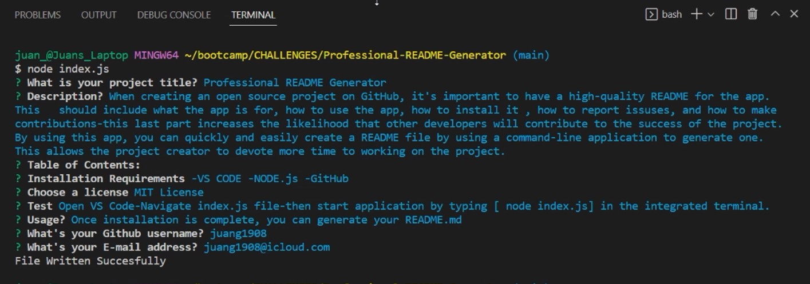

# Professional README Generator

## Table of Contents

[Description](#description)
[Installation](#installation)
[Test](#test)
[Usage](#usage)
[E-mail](#email)
[Github](#github)
[License](#license)

### Description

When creating an open source project on GitHub, it's important to have a high-quality README for the app. This should include what the app is for, how to use the app, how to install it , how to report issuses, and how to make contributions-this last part increases the likelihood that other developers will contribute to the success of the project. By using this app, you can quickly and easily create a README file by using a command-line application to generate one. This allows the project creator to devote more time to working on the project.

### Installation

-VS CODE
-NODE.js
-GitHub

### Test

Open VS Code-Navigate index.js file-then start application by typing [ node index.js] in the integrated terminal.

### Usage

Once installation is complete, you can generate your README.md

### E-mail

juang1908@icloud.com

### Github

juang1908
https://github.com/Juang1908

### Walkthrough Video and Screenshot

[Video DEMO](images/README.webm)

    ### License
    For more information about this license please visit
    [MIT License](https://opensource.org/)
